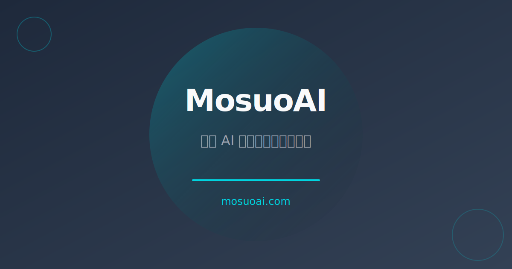

# MosuoAI 🚀

A modern, feature-rich Astro blog theme designed for tech content creators.



## ✨ Features

- 🎨 **Beautiful Design**: Modern dark/light theme with smooth transitions
- 📱 **Responsive**: Mobile-first design that works on all devices
- 🚀 **Fast**: Built with Astro for optimal performance
- 🎯 **SEO Optimized**: Full SEO support with Open Graph and Twitter cards
- 📝 **Content Types**: Support for News, Tutorials, Reviews, Open Source, and Resources
- 🔍 **Search**: Built-in search functionality
- 📖 **Table of Contents**: Auto-generated TOC for articles
- 🌓 **Theme Toggle**: Dark/Light mode with system preference detection
- 💅 **Syntax Highlighting**: Beautiful code blocks with language labels
- 📊 **Popular Articles**: Dynamic popular articles widget
- 🏷️ **Tags**: Tag-based content organization

## 🎯 Quick Start

### 1. Use this template

Click the **"Use this template"** button on GitHub to create your own repository.

### 2. Clone and install

```bash
git clone https://github.com/your-username/your-repo.git
cd your-repo
npm install
```

### 3. Configure

Edit `src/config.mjs` to customize your site:

```javascript
export const siteConfig = {
  name: 'Your Site Name',
  description: 'Your site description',
  url: 'https://your-domain.com',
  twitter: '@yourhandle',
  navLinks: [
    { label: '首页', href: '/' },
    { label: '资讯', href: '/news' },
    // Add your own links
  ],
};
```

### 4. Add content

Create articles in `src/content/`:

```
src/content/
├── news/
│   └── my-first-article.md
├── tutorials/
│   └── getting-started.md
└── config.ts
```

### 5. Run locally

```bash
npm run dev
```

Visit `http://localhost:4321` to see your site.

### 6. Build for production

```bash
npm run build
```

## 📁 Project Structure

```
/
├── public/
│   ├── favicon.svg
│   └── og-default.svg
├── src/
│   ├── components/
│   │   ├── Header.astro
│   │   ├── Footer.astro
│   │   ├── SEO.astro
│   │   ├── Search.astro
│   │   └── PopularArticles.astro
│   ├── content/
│   │   ├── news/
│   │   ├── tutorials/
│   │   ├── reviews/
│   │   ├── opensource/
│   │   └── resources/
│   ├── layouts/
│   │   └── BaseLayout.astro
│   ├── pages/
│   │   ├── index.astro
│   │   ├── news/
│   │   ├── tutorials/
│   │   └── ...
│   ├── styles/
│   │   ├── common.css
│   │   └── variables.css
│   └── config.mjs
├── astro.config.mjs
├── package.json
└── README.md
```

## 🎨 Customization

### Theme Colors

Edit `src/styles/variables.css` to change the color scheme:

```css
:root {
  --color-primary: #00d4e0;
  --color-accent: #8b5cf6;
  /* ... */
}
```

### Fonts

The theme uses Inter for text and JetBrains Mono for code. To change fonts, edit `src/styles/variables.css`:

```css
:root {
  --font-sans: "Inter", sans-serif;
  --font-mono: "JetBrains Mono", monospace;
}
```

### Navigation

Edit `src/config.mjs` to change navigation links:

```javascript
navLinks: [
  { label: '首页', href: '/' },
  { label: '博客', href: '/blog' },
  { label: '关于', href: '/about' },
],
```

## 📝 Content Schema

Each content type has its own schema defined in `src/content/config.ts`. Here's an example article:

```markdown
---
title: "My First Article"
description: "A brief description"
pubDate: 2026-04-24
tags: ["tutorial", "getting-started"]
image: "/images/cover.jpg"
---

Your content here...
```

## 🚀 Deployment

### Cloudflare Pages (Recommended)

1. Push your repository to GitHub
2. Connect to Cloudflare Pages
3. Set build command: `npm run build`
4. Set output directory: `dist`

### Other Platforms

MosuoAI works with any static hosting platform:
- Netlify
- Vercel
- GitHub Pages
- AWS S3
- etc.

## 📄 License

MIT License - feel free to use this theme for any purpose.

## 🙏 Credits

Built with:
- [Astro](https://astro.build/)
- [Lucide Icons](https://lucide.dev/)
- [Expressive Code](https://expressive-code.com/)

---

Made with ❤️ by MosuoAI
